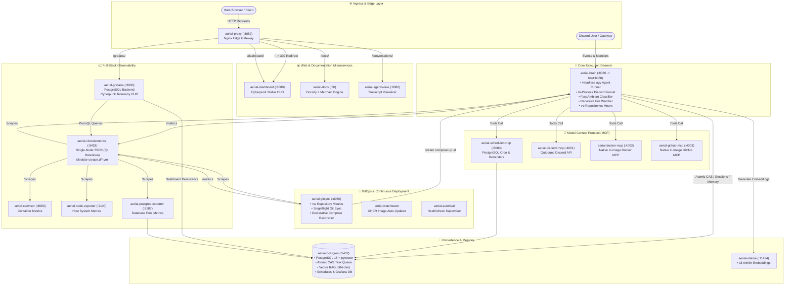

# 🛸 Aerial Documentation Matrix

Welcome to **Aerial Docs**, your personal living documentation and architecture portal with native **Mermaid.js** diagram rendering!

> [!NOTE]
> **Dynamic User Documentation**: This portal dynamically serves Markdown (`.md`) files from your private configuration repository (`aerial-config/docs/`).

---

## ⚡ System Architecture Topology



---

## 📂 Recommended Configuration Directory Structure

In your `aerial-config` repository:

```text
aerial-config/
├── config.yaml               # Core agent & channel policies
├── AGENTS.md                 # Persona & communication guidelines
├── channels/                 # Per-channel operational instructions
│   └── lounge.md
├── victoriametrics/          # Modular Prometheus scrape configs
│   └── homeassistant.yml
└── docs/                     # Living Docsify documentation portal
    ├── README.md             # Docs homepage
    ├── _sidebar.md           # Sidebar navigation
    ├── architecture.md       # Multi-container topology
    ├── observability.md      # TSDB, metrics & Grafana
    ├── gitops.md             # Continuous delivery & PR workflow
    ├── channels.md           # Discord interaction & wake modes
    └── security.md           # Admin allowlist & kernel security
```

---

## 🔍 Features Included
- **Zero-Build Hot Reloading**: Any commit or sync to `aerial-config` is immediately live in your browser.
- **Mermaid.js Engine**: Sequence diagrams, flowcharts, and architecture maps rendered in real time.
- **Offline / Local First**: 100% vendored assets with zero external CDN dependencies.
- **Permet Dark Theme**: Seamlessly integrated with the Cyberpunk status HUD.
