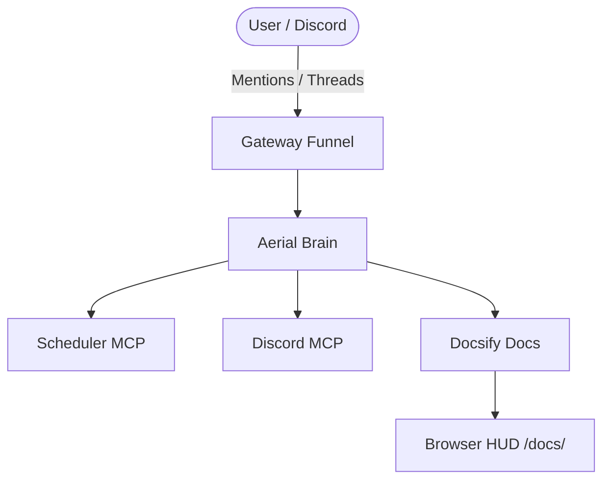

# 🛸 Aerial Documentation Matrix

Welcome to **Aerial Docs**, your personal documentation and architecture viewer with native **Mermaid.js** diagram rendering!

> [!NOTE]
> **Getting Started**: To add or edit your documentation, place Markdown (`.md`) files inside the `docs/` folder of your private configuration repository (`aerial-config/docs/`).

---

## ⚡ Interactive Mermaid Diagrams

You can embed Mermaid diagrams directly using ```` ```mermaid ```` code blocks:



---

## 📂 Recommended Directory Structure

In your `aerial-config` repository:

```text
aerial-config/
├── config.yaml
├── AGENTS.md
└── docs/
    ├── README.md          <-- Homepage (overrides this welcome screen)
    ├── _sidebar.md        <-- Sidebar navigation menu
    └── architecture.md    <-- Architecture diagrams & runbooks
```

---

## 🔍 Features Included
- **Zero-Build Hot Reloading**: Any commit or sync to `aerial-config` is immediately live.
- **Mermaid.js Engine**: Sequence diagrams, flowcharts, state diagrams, class diagrams, and entity-relationship models.
- **Offline / Local First**: 100% vendored assets, zero external CDN dependencies.
- **Permet Dark Theme**: Seamlessly integrated with the Cyberpunk status dashboard HUD.
