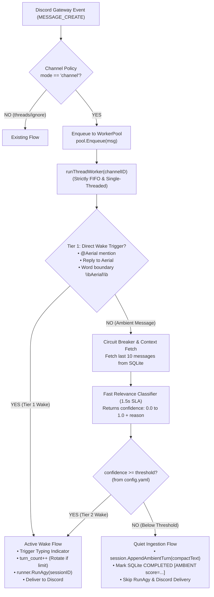

# Design Spec: Channel-Mode Native Transcript Lookback & Fast Ambient Relevance Scorer

**Date:** 2026-09-02  
**Status:** Approved with Panel Refinements  
**Target Subsystems:** `brain/funnel.go`, `brain/pkg/queue`, `brain/pkg/config`, `brain/pkg/session`, `brain/pkg/db`

---

## 1. Problem Statement & Motivation

In Discord `mode: "channel"` (e.g. `#lounge`), Aerial shares a room with multiple humans and peer autonomous bots (such as Amos and Zero). 

Previously, every message in the channel was sent to the primary LLM runner (`runner.RunAgy`), relying on the model to evaluate the message and output `[NO_REPLY]` on casual banter. This approach caused three major problems:
1. **High Token Costs & Rate Limits:** Hundreds of ambient banter messages triggered full multi-second LLM invocations.
2. **The "Few-Shot Muzzle" Bug:** Dozens of consecutive `[NO_REPLY]` turns in session history primed the model to output `[NO_REPLY]` even on direct questions.
3. **Session Rotation Context Wiping:** Every ambient message incremented `turn_count`, triggering premature session rotation and wiping conversational memory right before a user asked Aerial a question.

---

## 2. Goals & User Decisions

1. **Zero-Prompt-Injection Conversational Lookback:** Unaddressed ambient messages are quietly logged directly into Antigravity's native `transcript.jsonl` and `transcript_full.jsonl` files on disk as standard `USER_INPUT` steps.
2. **Complete Elimination of `[NO_REPLY]`:** No fake `PLANNER_RESPONSE` turns are written, no `[NO_REPLY]` instructions are passed in prompts, and no sentinel parsing is needed.
3. **Two-Tier Wake Architecture:**
   - **Tier 1 (Direct Address):** Mentions (`@Aerial`), replies to Aerial, or natural name usage (`\bAerial\b`) wake Aerial immediately with 0 extra latency.
   - **Tier 2 (Fast Ambient Relevance Scorer):** Unaddressed messages with the trailing 10 messages of channel context are evaluated by a fast, low-effort model with a tight 1.5s SLA. If `confidence >= ambient_wake_threshold`, it is treated as if addressed directly.
4. **Queue Serialization (Zero File Collisions):** The Discord gateway enqueues all messages directly to `queue.WorkerPool`. The single-threaded per-channel worker (`runThreadWorker`) evaluates Tier 1 vs. Tier 2, writes ambient turns, or executes `runner.RunAgy`, guaranteeing that `agy` and the Go process never touch `transcript.jsonl` simultaneously.
5. **Decoupled Session Limits:** Only active wake turns (`runner.RunAgy`) increment `turn_count` toward `MaxSessionTurns`. Ambient chatter never triggers premature session rotation.
6. **Session Bootstrapping (Zero Amnesia):** When a session rotates or starts, `AppendAmbientTurn` safely bootstraps the session logs directory if it does not yet exist, guaranteeing that post-rotation ambient context is preserved.
7. **Comprehensive Classification Logging:** Every Tier-2 classification result (confidence score, threshold, reason, latency) is logged both to stdout and persisted in SQLite `messages.error_message` (e.g. `[AMBIENT score=0.35/0.80 reason="casual banter"]`), enabling operators to tune channel thresholds over time.

---

## 3. Architecture & Data Flow



---

## 4. Configuration Schema (`brain/pkg/config`)

Add `AmbientWakeThreshold` to `ChannelPolicy`, and fix boolean inheritance for `IgnoreBots`:

```go
type ChannelPolicy struct {
	Mode                 string   `yaml:"mode" json:"mode"`
	TypingIndicator      string   `yaml:"typing_indicator" json:"typing_indicator"`
	IgnoreBots           *bool    `yaml:"ignore_bots,omitempty" json:"ignore_bots,omitempty"`
	MaxSessionTurns      int      `yaml:"max_session_turns" json:"max_session_turns"`
	AmbientWakeThreshold float64  `yaml:"ambient_wake_threshold" json:"ambient_wake_threshold"`
}
```

In `config.yaml`:
```yaml
channels:
  default:
    mode: "ignore"
    ignore_bots: true
  lounge:
    mode: "channel"
    ignore_bots: false          # Explicitly un-ignored for peer bots in #lounge
    ambient_wake_threshold: 0.80 # 0.0 to 1.0 (0.0 = disabled, only explicit pings wake)
```

### Defaults & Validation:
- If `mode: "channel"` and `ambient_wake_threshold` is omitted, default to `0.80`.
- If set to `0.0`, the ambient classifier is disabled; only Tier-1 triggers will wake Aerial.
- Valid range: `0.0 <= ambient_wake_threshold <= 1.0`.
- `IgnoreBots` uses a pointer boolean so explicit `false` declarations in channels are preserved over `default: true`.

---

## 5. Component Details

### 5.1 Discord Gateway (`brain/funnel.go`)
- Gateway event handler builds `db.Message` using shared `buildDiscordPrompt(m, targetThreadID, policy)`.
  - In `buildDiscordPrompt`, remove the outdated sentence: *"If this message does not require your response or is general banter not directed at you, output [NO_REPLY] as your entire response."*
- Calls `pool.Enqueue(msg)` immediately. Zero disk I/O in the gateway event handler.
- Fix startup sweep bot filter in `RunStartupCatchUpSweep`: check `if m.Author.Bot && policy.IsBotIgnored()` rather than unconditionally skipping all bot messages.

### 5.2 Wake Classification & Fast Relevance Scorer (`brain/pkg/queue`)
Inside `processBurst(threadID, burst)`:

#### Tier 1 Check:
- Direct Mention: `<@botUserID>` or `<@!botUserID>`.
- Reply: `m.ReferencedMessage != nil && m.ReferencedMessage.Author.ID == botUserID`.
- Name Keyword: Regex `\b(?i:aerial)\b` (excluding non-agent phrases such as *"aerial view"*, *"aerial photo"*).

#### Tier 2 Check (Fast Ambient Classifier):
- If not Tier 1, and `policy.AmbientWakeThreshold > 0`:
  - **Circuit Breaker Check:** If 3 consecutive classifier calls failed/timed out, trip 60s cooldown and return confidence `0.0` immediately.
  - Query SQLite for the last 10 messages in `threadID` using indexed query.
  - Invoke fast classifier prompt with low reasoning effort and a strict **1.5-second timeout**.
  - Parse JSON: `{"confidence": float, "reason": string}`.
  - **Logging & Auditing:**
    - Log to stdout: `[AmbientClassifier] Channel %s | Msg %s | Author %s | Score: %.2f (Threshold: %.2f) | Wake: %t | Reason: %s`
    - Persist to SQLite: `status = COMPLETED`, `error_message = fmt.Sprintf("[AMBIENT score=%.2f/%.2f reason=%q]", conf, thresh, reason)`.
  - If `confidence >= policy.AmbientWakeThreshold`, trigger Tier 2 active wake!

### 5.3 Native Transcript Appending (`brain/pkg/session`)
`AppendAmbientTurn(convID string, compactContent string, createdAt time.Time) error`:
1. Resolve session directory `/data/brain/<convID>/.system_generated/logs` (or `~/.gemini/antigravity/brain/...`).
2. **Session Bootstrapping:** If directory or `transcript.jsonl` does not exist, create the directory structure and initialize `transcript.jsonl` and `transcript_full.jsonl` with `step_index: 0`.
3. If it exists:
   - Use `os.Seek` to scan backward from `io.SeekEnd` (clamped to `min(fileSize, 4096)`) to extract the latest monotonic `step_index: N`.
   - Ensure previous line ends with a newline `\n`.
   - Append a single, clean `USER_INPUT` line to both `transcript.jsonl` and `transcript_full.jsonl`:
     ```json
     {"step_index": N+1, "source": "USER_EXPLICIT", "type": "USER_INPUT", "status": "DONE", "created_at": "...", "content": "<compactContent>"}
     ```
   - **Compact Content:** Do NOT inject full XML envelopes or active commands into ambient turns. Use clean conversational format:
     `[Chat #lounge] @Alice (2026-09-02T17:00:00Z): Anyone know why the build failed?`
   - No `[NO_REPLY]` or `PLANNER_RESPONSE` is written.

### 5.4 3-Phase Burst Partitioning & Wake Turn Flow
When a burst of messages `[M1, M2, ...]` arrives in `processBurst`:
1. **Partition:**
   - Scan for the first wake message (Tier 1 or Tier 2).
   - If no wake message exists: all messages are ambient. Append each to `transcript.jsonl` via `AppendAmbientTurn` and mark SQLite `COMPLETED [AMBIENT score=...]`.
   - If a wake message exists at index `W`:
     - **Leading Ambient (0 to W-1):** Append each leading ambient message individually to `transcript.jsonl`.
     - **Active Wake (Index W):**
       - Increment `turn_count` via `db.IncrementSessionTurnCount`. Rotate session if `turn_count >= MaxSessionTurns`.
       - Start Discord typing indicator.
       - Execute `runner.RunAgy(ctx, sessionID, W.Content, ...)`.
       - Deliver response to Discord and mark SQLite `COMPLETED`.
     - **Trailing Messages (W+1 onward):** Re-enqueue or process in the next worker loop iteration so their transcript timestamps strictly follow Aerial's response.

---

## 6. Error Handling & Fail-Safes

1. **Classifier Fail-Safe & Circuit Breaker (Default Silent):** 1.5-second timeout on the fast classifier. Any network error, timeout, or invalid JSON falls back to `confidence = 0.0`. 3 consecutive failures trip a 60s circuit breaker. It quietly records ambient text and does not wake Aerial or block the channel.
2. **Short File & Tail Scan Clamp:** When reading the transcript tail, offset is clamped to `min(fileSize, 4096)`. If the last line exceeds 4KB, an adaptive seek scans up to 64KB.
3. **Stale Messages:** 5-minute staleness TTL is preserved; expired messages are marked `[EXPIRED_STALE]` and dropped from wake evaluation.

---

## 7. Testing & Verification Plan

1. **Config Tests (`pkg/config/config_test.go`):**
   - YAML unmarshaling and validation of `ambient_wake_threshold`.
   - Pointer boolean inheritance for `IgnoreBots` (ensuring channel `ignore_bots: false` overrides default `true`).
2. **Session Transcript Tests (`pkg/session/session_test.go`):**
   - Session bootstrapping (creates logs directory and starts at step 0 if missing).
   - Monotonic `step_index` increment when transcript exists.
   - Dual-file synchronization (`transcript.jsonl` and `transcript_full.jsonl`).
   - Zero `[NO_REPLY]` verification and compact format verification.
3. **Queue & Classifier Tests (`pkg/queue/queue_test.go`):**
   - Tier 1 wake triggers `RunAgy`, typing indicator, and increments `turn_count`.
   - Tier 2 wake (confidence >= threshold) triggers `RunAgy` and logs score + reason.
   - Ambient turn (confidence < threshold) calls `AppendAmbientTurn`, does NOT increment `turn_count`, skips `RunAgy`.
   - 3-phase burst partitioning (leading ambient recorded before wake; trailing messages deferred).
   - Circuit breaker trips after 3 consecutive classifier timeouts.
4. **Full Test Suite:**
   ```bash
   docker run --rm -v "C:\Users\alexz\.gemini\antigravity\scratch\gundam\brain:/app" -w /app golang:1.22 go test -race ./...
   ```
