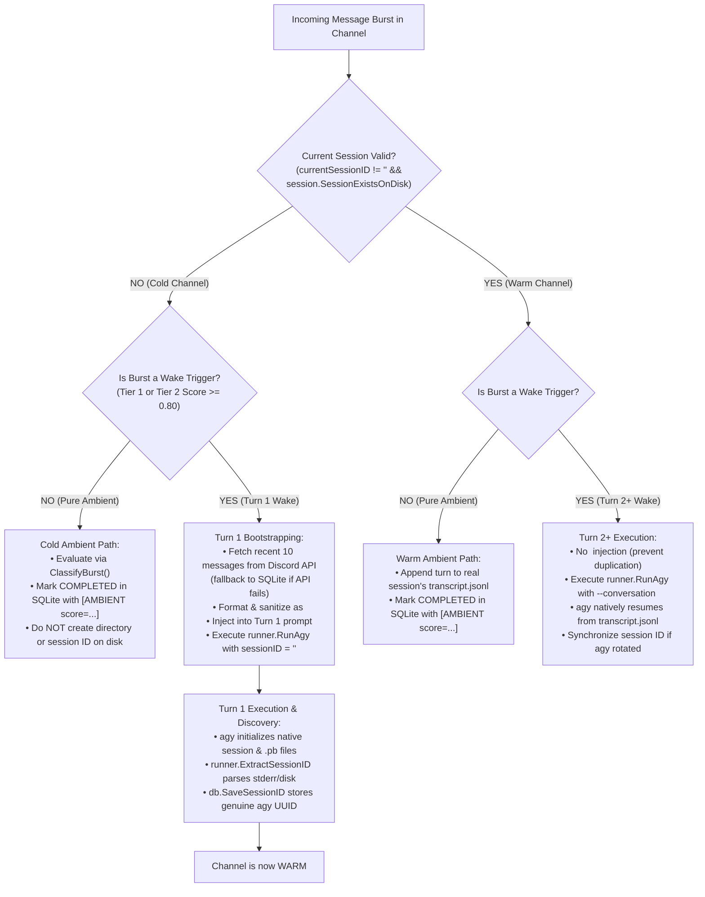

# Design Spec: Session Lifecycle, Cold/Warm State Management, & Turn 1 Context Bootstrapping

**Date:** 2026-09-03  
**Status:** Approved  
**Target Subsystems:** `brain/pkg/session`, `brain/pkg/queue`, `brain/pkg/runner`, `brain/pkg/db`

---

## 1. Problem Statement & Motivation

During multi-turn conversational testing in Discord channels (such as `#lounge`), Aerial exhibited a persistent **"50 First Dates" amnesia loop**: every successive message in a thread or channel was treated as a completely blank slate with zero multi-turn context, despite SQLite records indicating session persistence was active.

### Root Cause Analysis & Syscall Tracing
An `strace` syscall investigation of the `agy` binary in the `aerial-brain` runtime container identified the failure mechanism:
1. **`agy` Internal Session Lookup:** `agy` does not check for the presence of a `/data/brain/<uuid>/` folder or `transcript.jsonl` to validate an existing conversation. Instead, it checks for internal serialized Protocol Buffer files:
   - `~/.gemini/antigravity-cli/conversations/<uuid>.pb`
   - `~/.gemini/antigravity-cli/annotations/<uuid>.pbtxt`
2. **The Synthetic UUID Pitfall:** In `brain/pkg/queue/queue.go`, when ambient messages arrived on a cold channel (where Aerial had never executed a turn), the worker generated a synthetic UUID (`uuid.New().String()`), created an empty stub directory via `EnsureSessionDir()`, and persisted the synthetic UUID to SQLite.
3. **Silent Rejection by `agy`:** When a wake trigger arrived, Aerial called `agy --conversation <synthetic_uuid>`. Because no `.pb` file existed for this ID, `agy` emitted:
   ```text
   warning: conversation "<synthetic_uuid>" not found, ignoring --conversation flag
   ```
   and initialized a brand-new session with its own generated UUID. The ambient messages written to the synthetic directory were never read.
4. **The State Trap in `queue.go`:** Session ID extraction was guarded by:
   ```go
   if currentSessionID == "" {
       if extSess := runner.ExtractSessionID(stderr, startTime); extSess != "" {
           currentSessionID = extSess
           _ = db.SaveSessionID(p.cfg.DB, threadID, currentSessionID)
       }
   }
   ```
   Because `currentSessionID` was already populated with the synthetic UUID, this block was skipped entirely. Aerial discarded the real session ID created by `agy`, re-saved the dead synthetic ID back to SQLite upon turn completion, and repeated the failure on every turn.

---

## 2. Core Invariants & Goals

1. **Invariant 1 (Zero Unverified UUIDs in SQLite):** The SQLite database must never store a session UUID that was generated outside of `agy`. Every stored UUID must originate from `agy` execution and be verified on disk.
2. **Invariant 2 (Zero Stub Directories on Cold Channels):** Cold ambient chatter must not create placeholder directories or empty transcript files in `/data/brain/`.
3. **Invariant 3 (Unconditional Session Synchronization):** `queue.go` must unconditionally synchronize `currentSessionID` whenever `runner.ExtractSessionID` discovers an active session UUID from `stderr` or disk scan fallback.
4. **Invariant 4 (Complete Turn 1 Channel Context):** When starting Turn 1 on a cold channel, Aerial fetches the most recent $N$ messages directly from the Discord API (`dgSession.ChannelMessages`), ensuring context includes messages sent during bot downtime, restarts, or deployments.
5. **Invariant 5 (Single-Turn History Injection):** `<CHANNEL_HISTORY>` is strictly restricted to Turn 1. On Turn 2+, `agy` natively relies on its session transcript (`transcript.jsonl`), preventing duplicate context injection.

---

## 3. Architecture & State Machine

Channels operate in two distinct phases: **Cold Channel** and **Warm Channel**.



---

## 4. Component Changes & Implementation Details

### 4.1. Pre-Flight Disk Validation (`brain/pkg/session/session.go`)
Add explicit session verification:
```go
// SessionExistsOnDisk checks if the session has a valid agy conversation
// protobuf or non-empty transcript on disk.
func SessionExistsOnDisk(sessionID string) bool {
    if strings.TrimSpace(sessionID) == "" {
        return false
    }
    homeDir, _ := os.UserHomeDir()
    if homeDir == "" {
        homeDir = "/root"
    }

    // 1. Check agy conversation protobufs
    cliConvPb := filepath.Join(homeDir, ".gemini", "antigravity-cli", "conversations", sessionID+".pb")
    if fi, err := os.Stat(cliConvPb); err == nil && fi.Size() > 0 {
        return true
    }
    agyConvPb := filepath.Join(homeDir, ".gemini", "antigravity", "conversations", sessionID+".pb")
    if fi, err := os.Stat(agyConvPb); err == nil && fi.Size() > 0 {
        return true
    }

    // 2. Check transcript.jsonl non-empty status
    for _, dir := range getTargetDirs(sessionID) {
        tPath := filepath.Join(dir, ".system_generated", "logs", "transcript.jsonl")
        if fi, err := os.Stat(tPath); err == nil && fi.Size() > 0 {
            return true
        }
    }
    return false
}
```

### 4.2. Queue Worker State Management (`brain/pkg/queue/queue.go`)

#### 1. Eliminate Synthetic UUID Generation
In `processBurst`:
- In the `wakeIdx == -1` (pure ambient) branch: remove `uuid.New().String()` and `SaveSessionID`. Only call `session.AppendAmbientTurn` if `currentSessionID != ""` and `session.SessionExistsOnDisk(currentSessionID)` is true.
- In the active wake branch (`wakeIdx != -1`):
  ```go
  if currentSessionID == "" {
      currentSessionID, _ = db.GetSessionID(p.cfg.DB, threadID)
  }
  if currentSessionID != "" && !session.SessionExistsOnDisk(currentSessionID) {
      log.Printf("[Queue] Session %s for thread %s not found on disk. Clearing for fresh Turn 1.", currentSessionID, threadID)
      currentSessionID = ""
  }
  ```

#### 2. Unconditional Session Synchronization
Remove the broken `if currentSessionID == ""` guard:
```go
if extSess := runner.ExtractSessionID(stderr, startTime); extSess != "" && extSess != currentSessionID {
    log.Printf("[Queue] Active session synchronized for thread %s: %s -> %s", threadID, currentSessionID, extSess)
    currentSessionID = extSess
    _ = db.SaveSessionID(p.cfg.DB, threadID, currentSessionID)
}
```

### 4.3. Turn 1 Discord History Retrieval & Injection
Define a pluggable history fetcher on `WorkerPoolConfig`:
```go
type HistoryMessage struct {
    AuthorName string
    Content    string
    CreatedAt  time.Time
}

type HistoryFetcherFunc func(ctx context.Context, channelID string, beforeID string, limit int) ([]HistoryMessage, error)
```

**Default Implementation:**
- Calls `dgSession.ChannelMessages(channelID, limit, beforeID, "", "")` with a strict 2-second timeout context.
- Falls back to `db.GetRecentThreadMessages(p.cfg.DB, threadID, limit)` if `dgSession == nil` or if the Discord API fails.

**Prompt Formatting:**
When `currentSessionID == ""` (Turn 1):
```markdown
<CHANNEL_HISTORY>
Recent messages from this channel before your turn:
- [2026-09-03 14:00:10 UTC] Alice: Anyone know why the build failed?
- [2026-09-03 14:01:25 UTC] Bob: Looks like a nil pointer in auth.go
</CHANNEL_HISTORY>
```
Sanitizes author names and tag-escapes content, ordered chronologically.

---

## 5. Regression & Automated Test Plan

### Test 1: Ghost Session Recovery (`TestProcessBurst_GhostSessionRecovery`)
- **Setup:** Seed SQLite with `SaveSessionID(database, "chan-test", "stale-ghost-uuid")`.
- **Runner Mock:** Return `stderr` containing:
  ```text
  warning: conversation "stale-ghost-uuid" not found, ignoring --conversation flag
  Starting conversation update stream for real-agy-uuid-999
  ```
- **Assertion:** Verify `db.GetSessionID(database, "chan-test")` updates to `"real-agy-uuid-999"`. (Fails on old code, passes on new code).

### Test 2: Multi-Turn Continuity Resumption (`TestProcessBurst_MultiTurnContinuity_AfterRecovery`)
- **Setup:** Immediately following Test 1, process a second message on `"chan-test"`.
- **Assertion:** Verify `RunnerFunc` receives `sessionID == "real-agy-uuid-999"` on Turn 2, confirming multi-turn context resumes.

### Test 3: Zero Stub Directories on Cold Ambient Chatter (`TestProcessBurst_ColdChannel_NoStubDirectory`)
- **Setup:** Send ambient messages to a cold channel (`"chan-cold"`).
- **Assertion:** Verify `db.GetSessionID` remains `""`, and no directory is created under `/data/brain/` or `~/.gemini/antigravity/brain/`.

### Test 4: Turn 1 Context Injection (`TestProcessBurst_Turn1ContextInjection`)
- **Setup:** Mock `HistoryFetcherFunc` returning 2 prior channel messages. Process Turn 1 wake message.
- **Assertion:** Verify `turnPrompt` contains `<CHANNEL_HISTORY>` with the formatted messages. Process Turn 2 and verify `<CHANNEL_HISTORY>` is NOT injected.